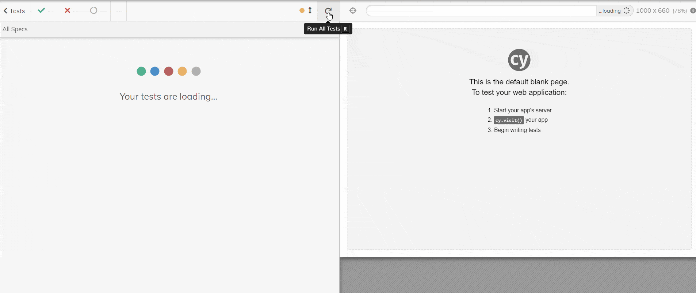

# randomusers
by Stephen Gift Mukoya Araka 

### Technologies Used
- Randomusers API version 1.3 - for generating random user data -  [view documentation here](https://randomuser.me/documentation)
- React version 18.1.0 [view release blog here](https://reactjs.org/blog/2022/03/29/react-v18.html)
- Material UI version 5.8.0 - [view here](https://mui.com/material-ui/)
- Axios version 0.27.2 - for HTTP requests - [view here](https://github.com/axios/axios)
- React Testing Library version 13.2.0 - for unit tests - [view docs here](https://testing-library.com/docs/react-testing-library/intro/)
- Cypress version 9.7.0 - for e2e tests - [view docs here](https://docs.cypress.io/)
- Figma - for design - [view design file here](https://www.figma.com/file/JgPhxtsUmiRqG8knkPhH7F/Jumia?node-id=0%3A1)

_Below is a simple mockup design of the app's UI:_

## Instructions
### 1. Running the application
#### a) Run Docker container 
1. Ensure that you have [Docker](https://www.docker.com/get-started/) installed
2. Clone the application repository from Github using the command below in your terminal:
&nbsp; `$ git clone https://github.com/StephenAraka/randomusers.git`
3. Change directory into the app folder:
&nbsp; `$ cd randomusers`
4. Build the application's Docker image:
&nbsp; `$ docker build -t randomusers .`
5. Run the newly built image:
&nbsp; `$ docker run -p 4000:3000 -d randomusers`
6. Open `http://localhost:4000` in your browser and the application should be running 🚀

#### b) Run locally 
1. Ensure that you have [Node.js](alendar.google.com) installed
2. Clone the application repository from Github using the command below in your terminal:
&nbsp; `$ git clone https://github.com/StephenAraka/randomusers.git`
3. Change directory into the app folder:
&nbsp; `$ cd randomusers`
4. Install the application's dependencies:
&nbsp; `$ npm install`
5. Run the application:
&nbsp; `$ npm start`
6. This will open `http://localhost:3000` in your browser where the application should be running 🤟`

_Below is a preview of the running application:_

### 2. Testing the application
1. In order to run **unit tests** with the react teating library, run the following command in the app's root folder:
&nbsp; `$ npm run test`
2. To run **e2e tests** using cypress, run the application locally ash shown above:
3. In the app's root folder, run the following command to start cypress:
&nbsp; `$ npx cypress open`
4. Use the cypress interface to run the test named `search_spec.js`
_Below is a preview of the e2e testing of the application using cypress:_

## Recommened improvements
- Originally, the intention was to implement the application in both [React](https://github.com/StephenAraka/randomusers/tree/react) and [Angular](https://github.com/StephenAraka/randomusers/tree/angular). Given more time, I will implement the Angular version of the application in the [angular github branch](https://github.com/StephenAraka/randomusers/tree/angular).
- More testing - _both E2E and Unit Tests_
